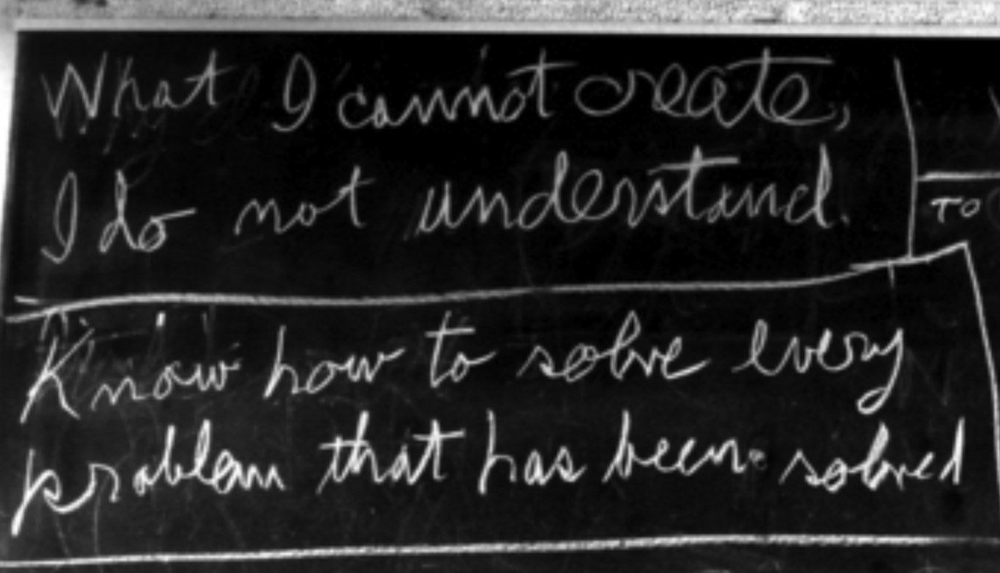

picoGPT
=========

In the spirit of Feynman' last blackboard saying (the one on top), here I plan someday to create a minimalistic chatbot from scratch. In the mean time, please check out my [toy transformer](https://github.com/rsnemmen/toy-transformer) repo.

Feynman's last blackboard. [Credit: Robert Paz, Caltech archives.](https://pubs.aip.org/physicstoday/article-abstract/42/2/88/405525/Feynman-s-Office-the-Last-Blackboards?redirectedFrom=fulltext)
